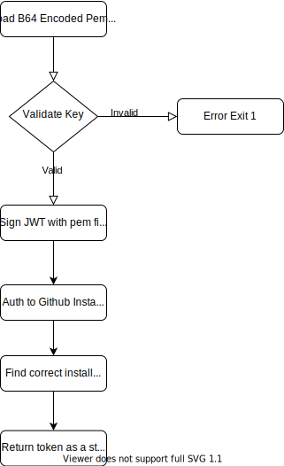

## Github App Token Gen Utility

[](https://circleci.com/gh/stephenh1991/gha-token-generator/tree/main)

This app is a small binary which simplifies usage of Github App authentication (see this link for more info: [link](https://docs.github.com/en/developers/apps/building-github-apps/authenticating-with-github-apps#authenticating-as-a-github-app))

### Installation

Download pre-compiled binaries:
```shell
curl -o gha-token-generator_1.0.0_Darwin_x86_64.tar.gz https://github.com/stephenh1991/gha-token-generator/releases/download/v1.0.0/gha-token-generator_1.0.0_Darwin_x86_64.tar.gz

tar -vxf gha-token-generator_1.0.0_Darwin_x86_64.tar.gz

mv token-generator_darwin_amd64/gha-token-generator /usr/local/bin/gha-token-generator

```

pre-built docker image: https://hub.docker.com/r/steveh1991/gha-token-generator

### Quickstart

To run the tests locally run: 
```shell 
make generate-test-data

make test
```

To build locally, binaries are output in `bin/`:
```
make build
```

### How it works

The pem key file generated via the Github console (see above docs for how this is done at the org level) is loaded via the `-pem-key` flag as a base64 encoded string.

Use the following flags to configure the generator:

```shell
  -app-id int
        Required: int value of installed Github App ID from the Github console
  -org-name string
        Required: name of the users github handle or organisation name where the Github app is installed
  -pem-key string
        Required: base64 encoded string form key.pem generated from Github App page
```

The base64 encoding is used to avoid line break stripping in the CI.

The token generator follows this flow:



All errors will exit the app and cause the current shell instance to fail with a useful error.

## Releases
Releasing this app is done using `go-releaser` the config file resides in: [.goreleaser.yml](.goreleaser.yml) and more info can be found in the project itself: https://github.com/goreleaser/goreleaser
